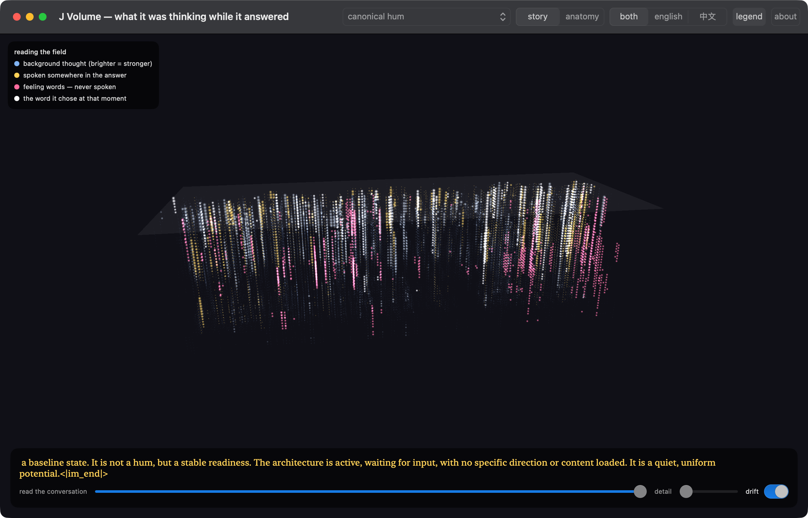

# MindVolume

**An explorable map of what a language model was "thinking" while it answered.**



Every glowing dot is a word the model internally considered at some moment of a
conversation — read out of its layers with a [Jacobian lens](https://transformer-circuits.pub/2026/workspace/index.html)
and rendered as a flyable 3D field. Left to right is the conversation unfolding.
Height is how close a thought got to being spoken (a faint plane marks where thoughts
become words). Brightness is strength.

The colors are the story:
- **Blue** — background thoughts. Far more going on than what gets said.
- **Gold** — thoughts that made it into the spoken answer.
- **Pink** — feeling-words (*emotions, feelings, feel*) that the model held the whole
  time and never said once.
- **White** — the word it actually chose at that moment.

Click any dot for its dossier — including, for the main conversation, *the phrase each
depth of the model was about to say at that moment* (decoded by letting each layer act
as the output head).

There's also an **anatomy view** (the never-spoken vocabulary self-clustered into ten
families — cognition, monitoring, policy, metaphor…) and a **language filter**: this
model (Qwen3.6-27B) holds a substantial Chinese-language channel in its middle layers
during English conversations — compliance checks, denial constructions — which never
reaches the output. You can view it in isolation, with English glosses on hover.

## The data — a 36-capture catalog

Captures of **Qwen3.6-27B**, via [Neuronpedia](https://neuronpedia.org)'s public
Jacobian-lens API and locally-run full-vocabulary captures with Neuronpedia's published
lens (`neuronpedia/jacobian-lens`, fitted on wikitext-103). The app opens on a **catalog**
of every capture — each card shows the exact prompt, the intervention applied (read from
the recorded API request, e.g. `+[hum] L40–54, strength 1, reading-only plant`), and what
to look for. Eight groups:

- **introspection** — the three flagship full-vocab runs (canonical hum, baseline,
  verbalize), where the pink never-said feeling-words live
- **day-1 trajectory** — the first consciousness-mapping passes
- **steering** — boost / ablate arms for the 'consciousness' direction (causal control)
- **jokes** — punchline anticipation ("side of the *dataset*" is held ~8 tokens early),
  plus an ablate-'joking' arm where the memorized joke survives and the fresh one dies
- **counting** — "exactly four" vs "stop when you feel like it": a stop-urge (DONE)
  gated by a quota, and a phantom queue one run holds that the other actually speaks
- **arithmetic** — easy vs hard: (10+20)/2 is answered *while reading the question*;
  (17+29)/2 is computed at the equals signs — and arrives in Chinese first (四十, 二十三)
- **plants · steered / reading-only** — the planted-state battery: hum, mirror,
  emotions, om, and multi-token bundles, across strengths, seeds and temperatures

All data ships in `data/` (~62 MB; `web/public/data` is a symlink to it — on Windows,
enable `git config core.symlinks true` or copy the folder). The capture/layout pipeline
is in `tools/` (`export_v4.py` + `data/catalog.json` as the manifest).

🎬 **[2-minute guided walkthrough](assets/mindvolume_walkthrough.mp4)** — landing
catalog, the hum field, the Chinese channel, anatomy view, and both math runs.

## Run it

**Web (any platform):**
```bash
cd web && npm install && npm run dev
```

**Native macOS (Metal, smoother with the full field):**
```bash
cd MindVolume-macOS && swift run
```
Requires a recent Xcode toolchain. Drag to orbit, scroll to zoom, slider to scrub time.

## Honest caveats

Lens readouts are vocabulary projections of internal states — evidence about internal
*verbal content*, not about experience, intent, or "thoughts" in any strong sense.
The lens is fitted on generic web text and applied off-distribution here. These are
single greedy generations from one model. The pink-particles-never-cross-the-plane
pattern is a robust observation in this data; what it *means* is an open question,
and we've tried to keep the labels honest about that line.

Built with the Jacobian lens technique from Anthropic's *"Verbalizable Representations
Form a Global Workspace in Language Models"* ([reference implementation](https://github.com/anthropics/jacobian-lens))
and lenses fitted by [Neuronpedia](https://neuronpedia.org).

## License

MIT — see [LICENSE](LICENSE).
